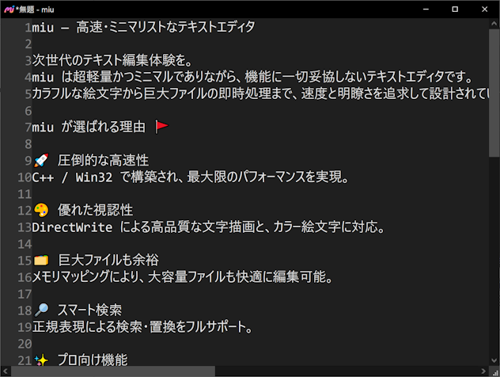

# miu — 次世代テキストエディタ

✨AIを活用した超高速テキストエディタです。カラフルな絵文字に対応。C++/Win32 で軽快に動作し、大容量ファイルの高速編集が可能です。

[ライセンス](https://github.com/kenjinote/miu/blob/master/LICENSE.TXT)

## 主な特徴 🚩

- 🚀 Win32 API と C++ による高いパフォーマンス
- 🗂 メモリマップドファイルを用いた大容量ファイル対応
- 🔎 正規表現検索、大小文字の区別、単語単位での検索／置換
- ✨ マルチカーソル、矩形選択での同時編集
- 🎨 DirectWrite による高品質レンダリングとカラー絵文字対応
- ↩↪ 無制限の Undo／Redo
- ⌨ 豊富なショートカットキーと F1 によるヘルプ表示
- 🔒 安全なファイル操作と安定性重視の設計

## 対応環境

- Windows 11 / Windows 10

## 開発環境

- Visual Studio 2022

## ダウンロード ⬇

最新リリースは [Releases](https://github.com/kenjinote/miu/releases) からダウンロードできます。

## 連絡先 📬

ご意見・ご要望・バグ報告は [Issues](https://github.com/kenjinote/miu/issues) または [X/Twitter @kenjinote](https://x.com/kenjinote) までお願いいたします。